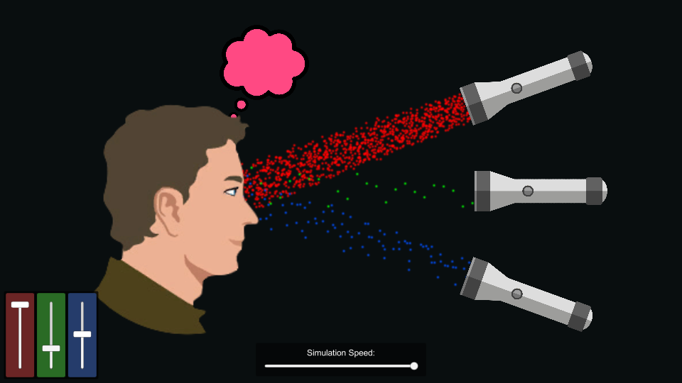
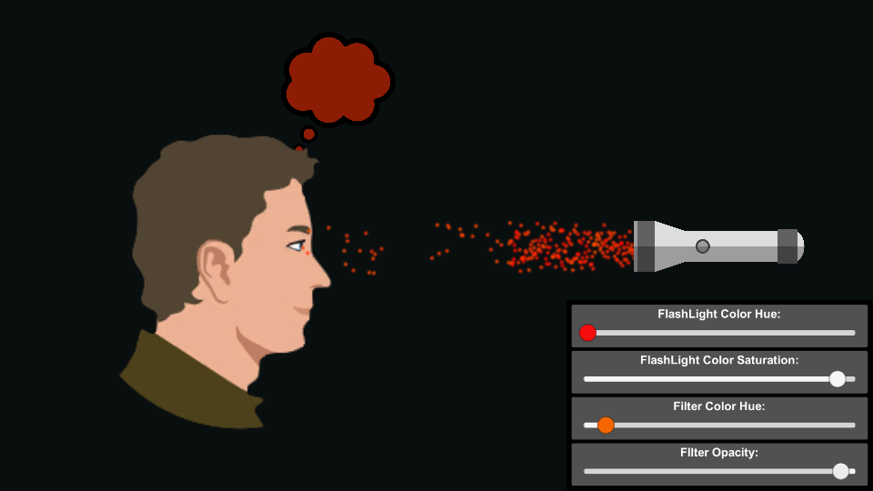
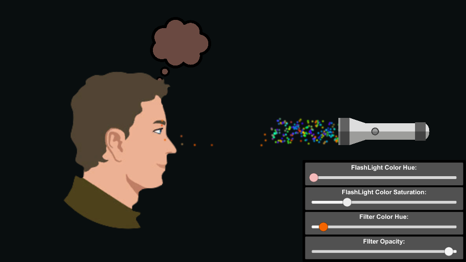

# Color-Vision
Recreation a Phet Interactive Simulation in Unity!

**Original Experiment:** [https://phet.colorado.edu/en/simulation/color-vision]()

## Screenshots
MultiLights:


SingleLight (with Filter):



## About Development

This programming exercise was required as a job adimission process, which consist
recreate one simulation of Phet Colorado using Unity or Unreal. I decided use Unity,
because it's more comfortable to me program in C# with Unity Framework.

Some of my difficulties in this project:

When I saw the experiment on Phet site, I realized that the particles aren't
absorbed by the person. Instead, they just read some values and calculate some variables
using this values. On my first attempt, I believed that maybe I could have used those particles data to compute the color. I was wrong. Unity's particles collisions work kind diffent from normal collisions. Let me explain:

When a colision occours iat some object, is possible get all data from collision. Not just the hit point or normal vector but the entire object which make the collision.
With the particles, this nor possibles. You are limited only to colision data, and can't
figured out what particle colision, or even worse, can't read and manipulate the particle
which make the colision. Then I tried use triggers instead.

When a trigger get fired, is possible get all data from every particle. That's sound nice, but there another limitation. If use more then one
trigger, it's impossible determine what trigger was fired!

So, after expend many hours trying to figure out a way to make it possible, I gave up, and surrendered to a "Gambiarra". 

```
    Gambiarra:

    A brazilian expression. It basically means to use improvised methods / solutions to solve a problem, with any avaiable material.
```

## About Experiment
### Topics
- Photons
- Monochromatic Light
- White Light
- Rainbows

### Description
Make a whole rainbow by mixing red, green, and blue light. Change the wavelength of a monochromatic beam or filter white light. View the light as a solid beam, or see the individual photons.

### Sample Learning Goals
Determine what color the person sees for various combinations of red, green, and blue light.
Describe the color of light that is able to pass through different colored filters.

## Requirements
 - Unity Editor 2017.3