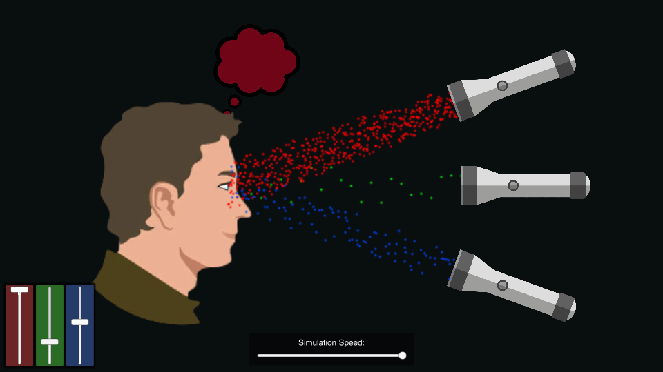

# Color-Vision
Recreation a Phet Interactive Simulation in Unity!

**Original Experiment:** [https://phet.colorado.edu/en/simulation/color-vision]()

## Screenshots

## About
### Topics
- Photons
- Monochromatic Light
- White Light
- Rainbows

### Description
Make a whole rainbow by mixing red, green, and blue light. Change the wavelength of a monochromatic beam or filter white light. View the light as a solid beam, or see the individual photons.

### Sample Learning Goals
Determine what color the person sees for various combinations of red, green, and blue light.
Describe the color of light that is able to pass through different colored filters.

## Requirements
 - Unity Editor 2017.3